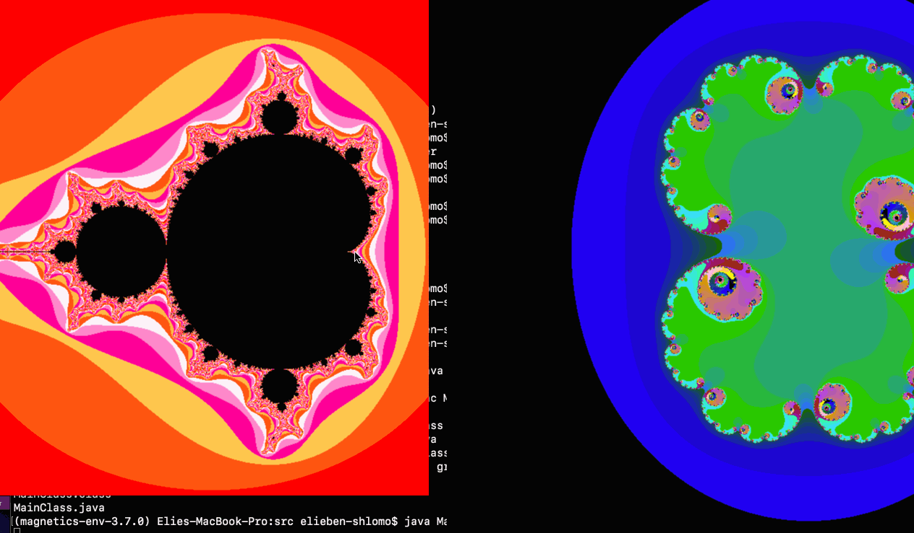

This codebase illustrates the relationship between the famous Mandelbrot set fractal, and its lesser known sister, the Julia set. Every point in the complex plane corresponds to a unique Julia set. Those points inside the Mandelbrot set correspond to 'Connected' Julia sets, and those points outside the Mandelbrot set correspond to 'Totally Disconnected' Julia sets. An in depth mathematical exposition of this relationship can be found here https://en.wikipedia.org/wiki/Mandelbrot_set#Relationship_with_Julia_sets. As the user moves the cursor around, they will see different Julia sets generated that correspond to the cursor location. To run 
```Unix
cd src
javac MainClass.java
java MainClass 
```

